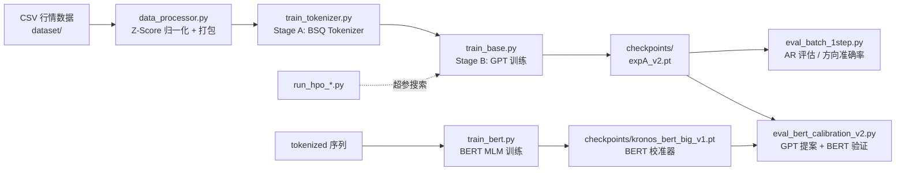
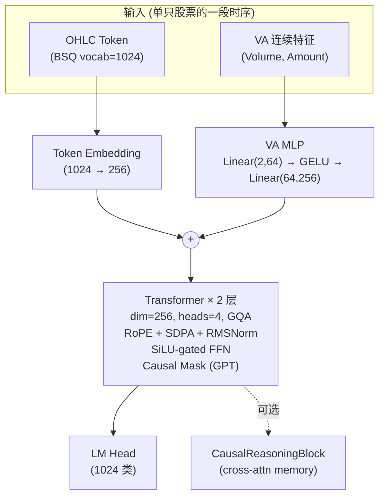
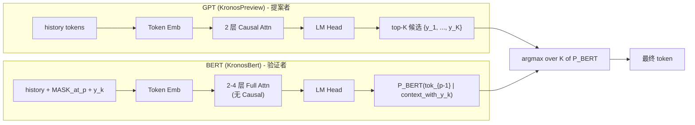
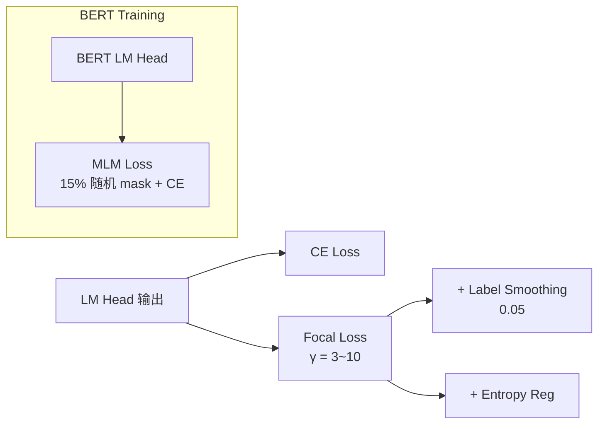

# Kronos-R-Preview 架构图

## 整体数据 / 训练流程

## 模型内部结构 (2.7M 参数)

## 双模型架构 (2026-06-17 新增) ★

## Loss / 训练选项

## 文件模块一览

| 层级 | 文件 | 职责 |
|------|------|------|
| 配置 | [config.py](file:///d:/Kronos-R-Preview/config.py) | NormConfig / DataConfig / TokenizerConfig / ModelConfig / TrainingConfig |
| 数据 | [data_processor.py](file:///d:/Kronos-R-Preview/data_processor.py) | 归一化 + 文档打包 |
| Tokenizer | [model/tokenizer.py](file:///d:/Kronos-R-Preview/model/tokenizer.py) | BSQ 2-level hierarchical |
| 模型 (GPT) | [model/kronos_preview.py](file:///d:/Kronos-R-Preview/model/kronos_preview.py) | GPT Transformer + VA Embedding (causal) |
| 模型 (BERT) | [model/kronos_bert.py](file:///d:/Kronos-R-Preview/model/kronos_bert.py) | BERT Transformer (bidirectional + MLM) |
| 训练 | [train_tokenizer.py](file:///d:/Kronos-R-Preview/train_tokenizer.py) | Stage A：Tokenizer 训练 |
| 训练 | [train_base.py](file:///d:/Kronos-R-Preview/train_base.py) | Stage B：GPT 训练 |
| 训练 | [train_bert.py](file:///d:/Kronos-R-Preview/train_bert.py) | Stage C：BERT 校准器训练（MLM 15% mask） |
| 评估 | [eval_batch_1step.py](file:///d:/Kronos-R-Preview/eval_batch_1step.py) | GPT-only 1-step 评估 |
| 评估 | [eval_cross_loss.py](file:///d:/Kronos-R-Preview/eval_cross_loss.py) | 跨 loss 公平评估 |
| 评估 | [eval_bert_calibration.py](file:///d:/Kronos-R-Preview/eval_bert_calibration.py) | V1 联合打分 P_GPT^α·P_BERT^(1-α) |
| 评估 | [eval_bert_calibration_v2.py](file:///d:/Kronos-R-Preview/eval_bert_calibration_v2.py) | ★ V2 提案-审议（推荐方案） |
| HPO | [run_hpo_v3_het.py](file:///d:/Kronos-R-Preview/run_hpo_v3_het.py) / [run_hpo_v4_het_refined.py](file:///d:/Kronos-R-Preview/run_hpo_v4_het_refined.py) | 异方差 HPO 搜索 |
| 流水线 | [run_full_pipeline.py](file:///d:/Kronos-R-Preview/run_full_pipeline.py) | 端到端串联 |

## 推理流程

## 完整技术栈

- **数据**: 4695 只 A 股，cutoff 2024-02-01
- **Tokenizer**: BSQ Hierarchical (4D OHLC → vocab 1024)
- **GPT**: dim=256, depth=2, heads=4, GQA (kv_heads=1), causal
- **BERT**: dim=256~512, depth=2~4, heads=4~8, full bidirectional
- **训练**: AdamW, bfloat16, gradient checkpointing (可选)
- **推理**: bfloat16, KV cache 未用 (AR 全序列重算)
